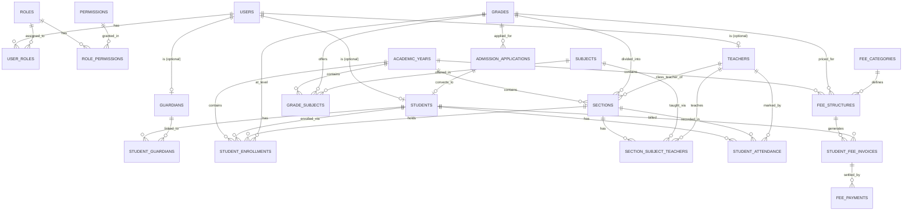

# School Management System — Core Database Schema

Covers: authentication & role-based access, students, teachers, guardians, grades/sections/subjects, enrollment, attendance, admissions, and fees. Designed in PostgreSQL syntax but portable to MySQL with minor tweaks (SERIAL → AUTO_INCREMENT, etc).

---

## 1. Entity-Relationship Overview



---

## 2. Auth & Role-Based Access Control

```sql
CREATE TABLE roles (
    id          SERIAL PRIMARY KEY,
    name        VARCHAR(50) UNIQUE NOT NULL,   -- 'admin', 'teacher', 'student', 'parent', 'accountant', 'librarian'
    description TEXT
);

CREATE TABLE permissions (
    id          SERIAL PRIMARY KEY,
    code        VARCHAR(100) UNIQUE NOT NULL,  -- 'student.create', 'fee.collect', 'attendance.mark'
    description TEXT
);

CREATE TABLE role_permissions (
    role_id       INT REFERENCES roles(id) ON DELETE CASCADE,
    permission_id INT REFERENCES permissions(id) ON DELETE CASCADE,
    PRIMARY KEY (role_id, permission_id)
);

CREATE TABLE users (
    id            SERIAL PRIMARY KEY,
    email         VARCHAR(150) UNIQUE NOT NULL,
    phone         VARCHAR(20),
    password_hash VARCHAR(255) NOT NULL,
    is_active     BOOLEAN DEFAULT TRUE,
    last_login_at TIMESTAMP,
    created_at    TIMESTAMP DEFAULT now(),
    updated_at    TIMESTAMP DEFAULT now()
);

-- Many-to-many: a user could be e.g. both 'teacher' and 'admin'
CREATE TABLE user_roles (
    user_id INT REFERENCES users(id) ON DELETE CASCADE,
    role_id INT REFERENCES roles(id) ON DELETE CASCADE,
    PRIMARY KEY (user_id, role_id)
);
```

**Why role + permission tables instead of a single `role` enum column on `users`:** it lets you add granular permissions later (e.g., "teacher can mark attendance but not edit fees") without a schema migration — just insert rows.

---

## 3. People: Teachers, Guardians, Students

```sql
CREATE TABLE teachers (
    id            SERIAL PRIMARY KEY,
    user_id       INT UNIQUE REFERENCES users(id) ON DELETE SET NULL,
    employee_no   VARCHAR(30) UNIQUE NOT NULL,
    first_name    VARCHAR(100) NOT NULL,
    last_name     VARCHAR(100) NOT NULL,
    gender        VARCHAR(10),
    dob           DATE,
    qualification VARCHAR(255),
    joining_date  DATE,
    phone         VARCHAR(20),
    email         VARCHAR(150),
    status        VARCHAR(20) DEFAULT 'active', -- active/inactive/resigned
    created_at    TIMESTAMP DEFAULT now()
);

CREATE TABLE guardians (
    id         SERIAL PRIMARY KEY,
    user_id    INT UNIQUE REFERENCES users(id) ON DELETE SET NULL,
    first_name VARCHAR(100) NOT NULL,
    last_name  VARCHAR(100) NOT NULL,
    relation   VARCHAR(30),  -- father/mother/guardian
    occupation VARCHAR(100),
    phone      VARCHAR(20),
    email      VARCHAR(150),
    address    TEXT
);

CREATE TABLE students (
    id             SERIAL PRIMARY KEY,
    user_id        INT UNIQUE REFERENCES users(id) ON DELETE SET NULL, -- nullable: younger students may not need logins
    admission_no   VARCHAR(30) UNIQUE NOT NULL,
    first_name     VARCHAR(100) NOT NULL,
    last_name      VARCHAR(100) NOT NULL,
    dob            DATE NOT NULL,
    gender         VARCHAR(10),
    blood_group    VARCHAR(5),
    address        TEXT,
    admission_date DATE NOT NULL,
    status         VARCHAR(20) DEFAULT 'active', -- active/inactive/graduated/transferred
    created_at     TIMESTAMP DEFAULT now()
);

-- Many-to-many: a student can have multiple guardians, a guardian multiple wards (siblings)
CREATE TABLE student_guardians (
    student_id  INT REFERENCES students(id) ON DELETE CASCADE,
    guardian_id INT REFERENCES guardians(id) ON DELETE CASCADE,
    is_primary  BOOLEAN DEFAULT FALSE,
    PRIMARY KEY (student_id, guardian_id)
);
```

---

## 4. Academic Structure: Years, Grades, Sections, Subjects

```sql
CREATE TABLE academic_years (
    id         SERIAL PRIMARY KEY,
    name       VARCHAR(20) NOT NULL,   -- '2026-2027'
    start_date DATE NOT NULL,
    end_date   DATE NOT NULL,
    is_current BOOLEAN DEFAULT FALSE
);

CREATE TABLE grades (
    id         SERIAL PRIMARY KEY,
    name       VARCHAR(50) NOT NULL,   -- 'Nursery', 'Grade 1' ... 'Grade 12'
    sort_order INT NOT NULL            -- for ordered display/promotion logic
);

CREATE TABLE subjects (
    id          SERIAL PRIMARY KEY,
    name        VARCHAR(100) NOT NULL,
    code        VARCHAR(20) UNIQUE,
    is_elective BOOLEAN DEFAULT FALSE
);

-- A grade is split into sections each year (Grade 5 -> 5A, 5B, 5C for 2026-2027)
CREATE TABLE sections (
    id                SERIAL PRIMARY KEY,
    grade_id          INT NOT NULL REFERENCES grades(id),
    academic_year_id  INT NOT NULL REFERENCES academic_years(id),
    name              VARCHAR(20) NOT NULL,  -- 'A', 'B'
    capacity          INT,
    class_teacher_id  INT REFERENCES teachers(id),
    UNIQUE (grade_id, academic_year_id, name)
);

-- Which subjects a grade offers in a given year
CREATE TABLE grade_subjects (
    id                SERIAL PRIMARY KEY,
    grade_id          INT NOT NULL REFERENCES grades(id),
    subject_id        INT NOT NULL REFERENCES subjects(id),
    academic_year_id  INT NOT NULL REFERENCES academic_years(id),
    UNIQUE (grade_id, subject_id, academic_year_id)
);

-- Which teacher teaches which subject in which section
CREATE TABLE section_subject_teachers (
    id         SERIAL PRIMARY KEY,
    section_id INT NOT NULL REFERENCES sections(id),
    subject_id INT NOT NULL REFERENCES subjects(id),
    teacher_id INT NOT NULL REFERENCES teachers(id),
    UNIQUE (section_id, subject_id)
);
```

---

## 5. Enrollment (year-by-year student placement)

```sql
CREATE TABLE student_enrollments (
    id                SERIAL PRIMARY KEY,
    student_id        INT NOT NULL REFERENCES students(id),
    academic_year_id  INT NOT NULL REFERENCES academic_years(id),
    grade_id          INT NOT NULL REFERENCES grades(id),
    section_id        INT NOT NULL REFERENCES sections(id),
    roll_no           VARCHAR(20),
    status            VARCHAR(20) DEFAULT 'active', -- active/promoted/repeated/withdrawn
    enrolled_on       DATE DEFAULT CURRENT_DATE,
    UNIQUE (student_id, academic_year_id)  -- one placement per student per year
);
```

**Why not just a `section_id` column on `students`:** a student's section changes every year, and promotions/repeats/transfers need to stay in history for report cards and transfer certificates. This table is your source of truth for "which section was student X in during year Y."

---

## 6. Attendance

```sql
CREATE TABLE student_attendance (
    id               SERIAL PRIMARY KEY,
    student_id       INT NOT NULL REFERENCES students(id),
    section_id       INT NOT NULL REFERENCES sections(id),
    attendance_date  DATE NOT NULL,
    status           VARCHAR(10) NOT NULL, -- present/absent/late/half_day/leave
    remarks          VARCHAR(255),
    marked_by        INT REFERENCES teachers(id),
    created_at       TIMESTAMP DEFAULT now(),
    UNIQUE (student_id, attendance_date)   -- one record per student per day (daily model)
);
```

> Kept as daily (one row per student per day) rather than per-period, since that's the common baseline. If you need period-wise attendance later, add a `period_id`/`subject_id` column and drop the daily uniqueness constraint in favor of `UNIQUE(student_id, attendance_date, period_id)`.

---

## 7. Admissions (pre-enrollment pipeline)

```sql
CREATE TABLE admission_applications (
    id                     SERIAL PRIMARY KEY,
    application_no         VARCHAR(30) UNIQUE NOT NULL,
    first_name             VARCHAR(100) NOT NULL,
    last_name              VARCHAR(100) NOT NULL,
    dob                    DATE NOT NULL,
    gender                 VARCHAR(10),
    applying_for_grade_id  INT NOT NULL REFERENCES grades(id),
    academic_year_id       INT NOT NULL REFERENCES academic_years(id),
    guardian_name          VARCHAR(150),
    guardian_phone         VARCHAR(20),
    guardian_email         VARCHAR(150),
    previous_school        VARCHAR(150),
    application_date       DATE DEFAULT CURRENT_DATE,
    status                 VARCHAR(20) DEFAULT 'pending', -- pending/under_review/approved/rejected/enrolled
    remarks                TEXT,
    converted_student_id   INT REFERENCES students(id)    -- set once approved & enrolled
);
```

Flow: application submitted → reviewed → approved → on enrollment, a `students` row and matching `student_enrollments` row are created, and `converted_student_id` is set back on this record.

---

## 8. Fees

```sql
CREATE TABLE fee_categories (
    id          SERIAL PRIMARY KEY,
    name        VARCHAR(100) NOT NULL,  -- 'Tuition', 'Transport', 'Lab', 'Library'
    description TEXT
);

-- What each grade owes, per year, per category
CREATE TABLE fee_structures (
    id                SERIAL PRIMARY KEY,
    grade_id          INT NOT NULL REFERENCES grades(id),
    academic_year_id  INT NOT NULL REFERENCES academic_years(id),
    fee_category_id   INT NOT NULL REFERENCES fee_categories(id),
    amount            NUMERIC(10,2) NOT NULL,
    frequency         VARCHAR(20) DEFAULT 'annual', -- annual/quarterly/monthly/one_time
    due_date          DATE,
    UNIQUE (grade_id, academic_year_id, fee_category_id, frequency)
);

-- Actual bill generated for a specific student
CREATE TABLE student_fee_invoices (
    id                SERIAL PRIMARY KEY,
    student_id        INT NOT NULL REFERENCES students(id),
    fee_structure_id  INT NOT NULL REFERENCES fee_structures(id),
    academic_year_id  INT NOT NULL REFERENCES academic_years(id),
    amount_due        NUMERIC(10,2) NOT NULL,
    due_date          DATE,
    status            VARCHAR(20) DEFAULT 'unpaid', -- unpaid/partial/paid/overdue/waived
    created_at        TIMESTAMP DEFAULT now()
);

CREATE TABLE fee_payments (
    id               SERIAL PRIMARY KEY,
    invoice_id       INT NOT NULL REFERENCES student_fee_invoices(id),
    amount_paid      NUMERIC(10,2) NOT NULL,
    payment_date     DATE DEFAULT CURRENT_DATE,
    payment_mode     VARCHAR(20),   -- cash/card/upi/bank_transfer/cheque
    transaction_ref  VARCHAR(100),
    collected_by     INT REFERENCES users(id),
    remarks          VARCHAR(255)
);
```

`fee_structures` → `student_fee_invoices` is deliberately one-to-many: a structure defines the template ("Grade 5 Tuition = ₹40,000/year"), and an invoice is the actual instance billed to one student (which can be discounted, waived, or partially paid independent of the template). `fee_payments` supports partial payments — sum them against `amount_due` to derive invoice status.

---

## 9. Recommended Indexes

```sql
CREATE INDEX idx_enrollment_year_section ON student_enrollments(academic_year_id, section_id);
CREATE INDEX idx_attendance_date ON student_attendance(attendance_date);
CREATE INDEX idx_attendance_section_date ON student_attendance(section_id, attendance_date);
CREATE INDEX idx_invoice_student_status ON student_fee_invoices(student_id, status);
CREATE INDEX idx_students_status ON students(status);
CREATE INDEX idx_applications_status ON admission_applications(status);
```

---

## 10. Natural Next Modules (not built now, but this schema won't fight them)

| Module | Sketch |
|---|---|
| **Exams & Grading** | `exams`, `exam_subjects`, `student_marks` (student_id, exam_subject_id, marks_obtained, grade) — hangs off `student_enrollments` |
| **Timetable** | `periods`, `timetable_slots` (section_id, subject_id, teacher_id, day_of_week, period_id) |
| **Library** | `books`, `book_copies`, `book_issues` (student_id/teacher_id, copy_id, issue_date, return_date) |
| **Transport** | `routes`, `vehicles`, `student_transport` (student_id, route_id, pickup_point) |
| **Staff attendance/payroll** | `teacher_attendance`, `salary_structures`, `salary_payments` — mirrors the fee pattern |
| **Notices/communication** | `notices`, `notice_recipients` (role_id or section_id scoped) |

Each of these joins onto tables you already have (`students`, `sections`, `teachers`, `academic_years`) rather than requiring changes to this core schema.
